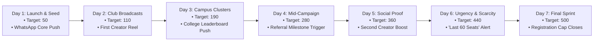

# 📈 Growth Plan: 500 Registrations in 7 Days (₹2,000 Budget)
### Campaign: "Build Your First AI Project in 60 Minutes" (NxtWave)

---

## Part 1: Understand the Student

### 1. Who Exactly Are We Targeting?
- **Target Profile:** 7th and 8th semester engineering undergraduates (Class of 2025/2026).
- **Key Branches:** Computer Science & Engineering (CSE), Information Technology (IT), Electronics & Communication (ECE), Electrical Engineering (EEE), and emerging AI/Data Science tracks.
- **Geographic Clusters:** Tier-1, Tier-2, and Tier-3 engineering colleges across India (e.g. Bangalore, Hyderabad, Pune, Chennai, Noida, Punjab).
- **Technical Baseline:** Students know basic programming syntax (Python, C++, or Java) from academic coursework, but have **zero production GenAI experience**.

### 2. Why Would They Care? (The Core Pain Points)
1. **Placement Anxiety & ATS Filtering:** Campus recruitment drives are increasingly screening out resumes that only list generic textbook projects (e.g. basic e-commerce sites, library management systems, simple calculators). Students need modern keywords like *LLM APIs, prompt engineering, and GenAI agents* to stand out.
2. **The "Tutorial Hell" Fatigue:** YouTube tutorials require 20–40 hours of heavy theory. Final-year students are overwhelmed with semester exams, capstone projects, and lab records; they do not have 30 hours to spare.
3. **The Blank Canvas Problem:** They want to build an AI project, but don't know where to start, which APIs to use, or how to get a working interface without getting stuck in environment setup errors.

### 3. What Makes Them Register Immediately?
- **Low Barrier & High Speed:** *"60 Minutes" + "Free" + "Online"*.
- **Tangible Artifact:** They don't just watch a lecture—they leave with a **live deployed web application and a public GitHub repo** they can link on LinkedIn and their resumes within 1 hour.
- **Specific Topic Relevance:** Building a *"Smart AI Resume Reviewer & ATS Matcher"* directly solves their own immediate need (placement prep) while serving as a portfolio project.

---

## Part 2: The 7-Day Marketing Campaign Plan

### The ₹2,000 Budget Allocation (Extreme Capital Efficiency)
| Channel | Allocation | Expected Direct Regs | Expected Viral Regs | Total Regs | Blended CAC |
| :--- | :---: | :---: | :---: | :---: | :---: |
| **1. WhatsApp Community Blitz & Club Admins** | ₹750 | 140 | 60 | 200 | ₹3.75 |
| **2. Student Tech Creator Micro-Sponsorships** | ₹750 | 120 | 50 | 170 | ₹4.41 |
| **3. Referral Milestone Incentive Fund** | ₹300 | — | 80 | 80 | ₹3.75 |
| **4. Paid Experimentation Reserve** | ₹200 | 35 | 15 | 50 | ₹4.00 |
| **TOTAL** | **₹2,000** | **295** | **205** | **500** | **₹4.00** |

---

## Prioritized Channels: The 3 High-Leverage Growth Engines

We intentionally reject scattered multi-channel noise (cold emails, paid Google ads, flyers). Instead, we focus on **three high-density channels**:

### Channel 1: WhatsApp Community Blitz (Primary Organic Acquisition)
- **Why It Works:** Indian engineering students live in WhatsApp. Every batch has section groups, lab groups, placement groups, and coding club groups. Message open rates in peer WhatsApp groups exceed **85% within 15 minutes**.
- **What We Do:**
  - Partner with 15 college coding club leads and placement coordinators across key colleges. Provide a ₹50 micro-incentive or exclusive AI prompt bundle for broadcasting our structured message to their 2025/2026 batch chats.
  - Distribute pre-tested, high-converting copy emphasizing the free 60-minute resume project.
- **Projection:** 140 direct registrations + 60 viral registrations = **200 registrations**.

### Channel 2: Student Micro-Creator Collaborations (Targeted Social Proof)
- **Why It Works:** Final-year student creators (tech influencers on Instagram/LinkedIn with 10k–30k followers) command authentic peer trust at 1/10th the cost of commercial influencers.
- **What We Do:**
  - Partner with 3 student creators (₹250 each). They post a 45-second Reel/Post: *"I found this free 60-min workshop by NxtWave where we build a working AI project for our placement resumes. Link in bio/stories."*
  - The link includes creator-specific UTM tags (`utm_source=creator_rahul`) to track exact conversion rates in the Admin Dashboard.
- **Projection:** 120 direct registrations + 50 viral referrals = **170 registrations**.

### Channel 3: The Built-in Viral Referral Engine (K-Factor Multiplier)
- **Why It Works:** A student who registers is in the highest state of motivation immediately after confirmation. Asking them to invite their project partner or lab group produces exponential lift.
- **What We Do:**
  - **Zero-Friction Trigger:** On the confirmation screen, students are prompted: *"Want to build this alongside your batchmates? Grab your unique invite link."*
  - **AI Sharing Assistant:** One-click generated WhatsApp messages tailored for *College WhatsApp Groups* and *Close Friends*.
  - **Milestone Gamification:** 
    - 3 referrals: *"AI Starter"* Badge + Curated GenAI Prompt Pack.
    - 5 referrals: *"AI Builder"* Badge + Technical Placement Interview Cheat Sheet.
    - 10 referrals: *"Growth Champion"* Badge + Featured spot on the Campus Leaderboard.
- **Projection:** Generates **205 peer referral registrations** (Viral coefficient $K \approx 0.41$).

---

## 7-Day Day-by-Day Execution Roadmap

| Day | Cumulative Target | Daily Target | Primary Operational Focus |
| :---: | :---: | :---: | :--- |
| **Day 1** | 50 | 50 | Seed in 5 core college WhatsApp groups; verify referral tracking and analytics. |
| **Day 2** | 110 | 60 | Deploy Creator 1 Reel; push initial batch of 3-referral badge unlocks. |
| **Day 3** | 190 | 80 | Activate college coding club coordinators; leaderboard visibility creates inter-college competition. |
| **Day 4** | 280 | 90 | Milestone trigger email/WhatsApp: *"You are 2 referrals away from unlocking AI Builder"*. |
| **Day 5** | 360 | 80 | Deploy Creator 2 Post; target colleges with high density (VIT, SRM, PES). |
| **Day 6** | 440 | 80 | Scarcity & FOMO push: *"440 / 500 seats filled. Only 60 seats remaining."* |
| **Day 7** | 500 | 60 | Final countdown broadcast; close registration form upon hitting 500. |

---

## Mathematical Feasibility & Unit Economics

$$\text{Total Registrations} = \text{Direct Registrations} \times (1 + K)$$

- **Paid/Direct Signups:** 295 students
- **Viral Coefficient ($K$):** 0.41 (Each registered student drives an average of 0.41 friends)
- **Viral Referrals:** $295 \times 0.41 \approx 205$ students
- **Final Registrations:** $295 + 205 = 500$ students
- **Blended CAC:** $\frac{₹2,000}{500} = \mathbf{₹4.00 \text{ per confirmed registration}}$
